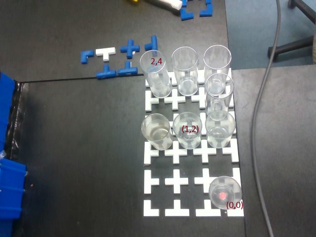
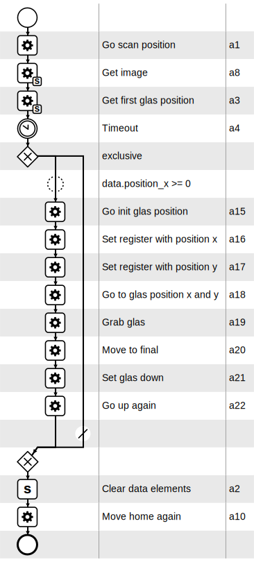

# Glass-Position-Recognizer

## Introduction

This repository contains the documentation of the Glas-Position-Recognizer project for the master lab "Advanced Practical Course - Sustainable Process Automation: Humans, Software and the Mediator Pattern (IN2128, IN2106, IN4303)". The main component is the classification model that recognizes which position of the 3x5 grid contains a glas. It has also links to other repositories which include software to develop the final product (which by the way is a RESTful service providing an endpoint to capture the image and an endpoint to return a list of all positions that contain a glass based on the image)

### Presentation

For the full demonstration take a look at the MP4 file inside `./video`


### Final product

Follow the [link](https://github.com/abrd97/recognizer) for the repository

#### Run

Follow the instructions to run the service (assuming using bash)
> NOTE: `librealsense` needs to be installed and the camera needs to be pluged in to be able to start the service. Otherwise the process will terminate. Follow the [installation section](##installation-fedora) to be able to run the app successfully
> 
> NOTE: When the server start, it also configures the camera and initializes the model for inference

- `python3.10 -m venv .venv`
- `source .venv/bin/activate` or on Windows with Git Bash `source .venv/Scripts/activate`
- `pip install -r requirements.txt`
- `uvicorn app:app --port 8000`

#### Services

There are two RESTful endpoints, which are exposed:

- GET - '/depth_image': It returns a base64 encoded 1280x720 depth image
- POST - '/config' with x-www-form-urlencoded argument `image=<base64 encoded image>`: It returns an array of all x and y offsets for each available glas

Here's an example image with (x, y)-tuples annotating the position offset
 


> NOTE: The image needs to be a depth image and with the resolution 1280x720

#### Process model

In the `./model` folder you will see the `glas_config.xml` to inspect all components. The image of the model below is quite self-explanatory
> NOTE: The `depth_image` and the `config` endpoint variables have placeholder domains for you to insert your custom domain



#### Other software

The listed apps below are not necessary to run the service but where are useful to develop the final model

1. An [app](https://github.com/abrd97/cobot_camera) to collect all ground truth data to train the model and the corresponding labels
2. A [collection](https://github.com/abrd97/cobot_model) of Jupyter Notebooks to prepare data for training and the actual training of a ResNet50 classification model
3. An [app](https://github.com/abrd97/labeling) that facilitates the labeling of approximately 1000 images which where cut into its smaller sub-images with the aforementioned repository

## Installation Fedora

This is a description for building the librealsense driver and library for Fedora from source. It includes a Python Wrapper.

```bash
    - sudo dnf update && upgrade
    - sudo dnf install python3.10 python3.10-devel
    - sudo dnf groupinstall "Development Tools"
    - sudo dnf install cmake libstdc++-devel gcc-c++ openssl openssl-devel libX11-devel libXcursor-devel mesa-libGL-devel mesa-libGLU-devel libXi-devel
    - git clone https://github.com/IntelRealSense/librealsense.git
    - cd librealsense
    - mkdir build
    - cd build
    - cmake -DBUILD_PYTHON_BINDINGS:bool=true ..
```

If CMake already fails due to missing Python dependencies, change the following lines in the following CMake file accordingly based on `git diff`:
- CMake/external_pybind11.cmake: 70-75:

```bash
-      find_package(Python REQUIRED COMPONENTS Interpreter Development)
-      set( PYTHON_INSTALL_DIR "${Python_SITEARCH}/pyrealsense2" CACHE PATH "Installation directory for Python bindings")
+      # find_package(Python REQUIRED COMPONENTS Interpreter Development)
+      # set( PYTHON_INSTALL_DIR "${Python_SITEARCH}/pyrealsense2" CACHE PATH "Installation directory for Python bindings")
+      # Manually set paths for Python 3.10 artifacts
+      set(Python_EXECUTABLE "/usr/bin/python3.10" CACHE FILEPATH "Python executable")
+      set(Python_INCLUDE_DIRS "/usr/include/python3.10" CACHE PATH "Python include directories")
+      set(Python_LIBRARIES "/usr/lib64/libpython3.10.so" CACHE FILEPATH "Python libraries")
+
+      # Set PYTHON_INSTALL_DIR based on manually set paths
+      set(PYTHON_INSTALL_DIR "/usr/lib/python3.10/site-packages/pyrealsense2" CACHE PATH "Installation directory for Python bindings")
+
+      message(STATUS "Fetching pybind11 - Done")
```

After CMake finished successfully, install librealsense:

```bash
- make -j4
- sudo make install
```
